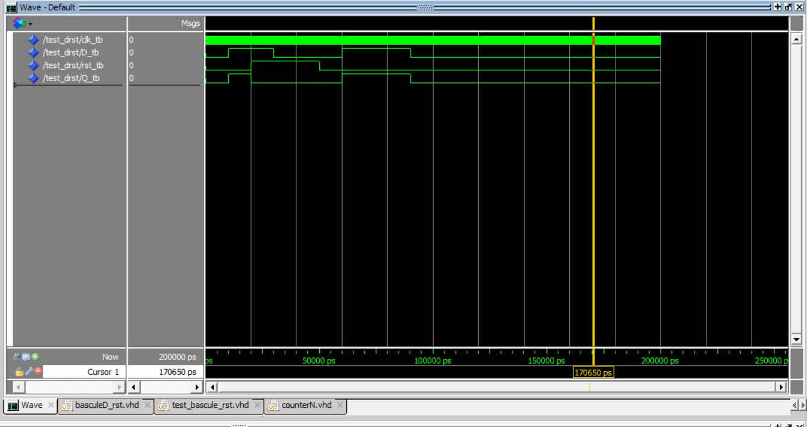
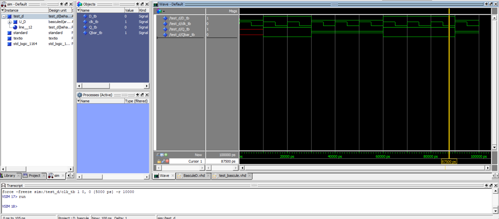
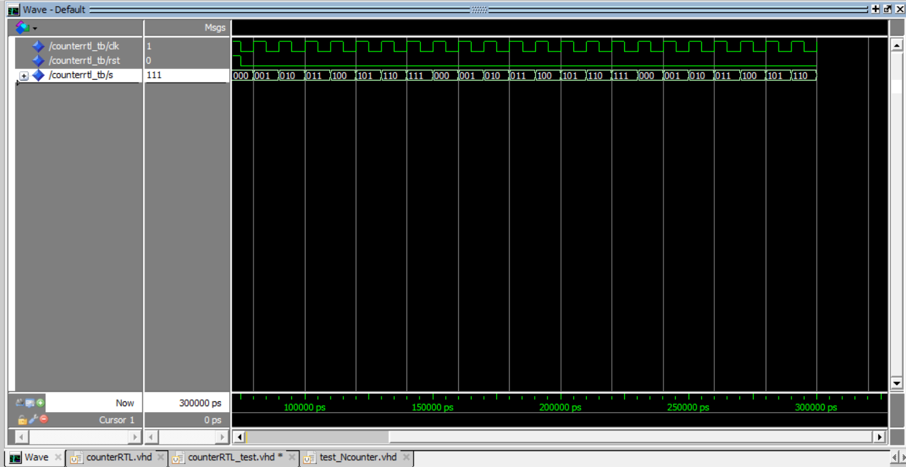
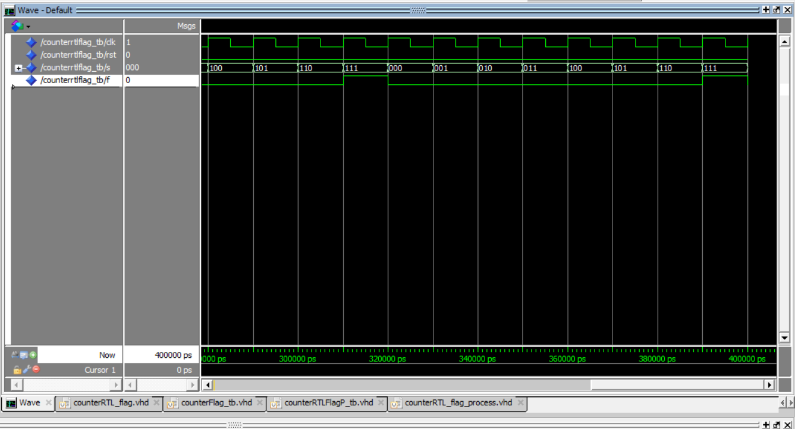
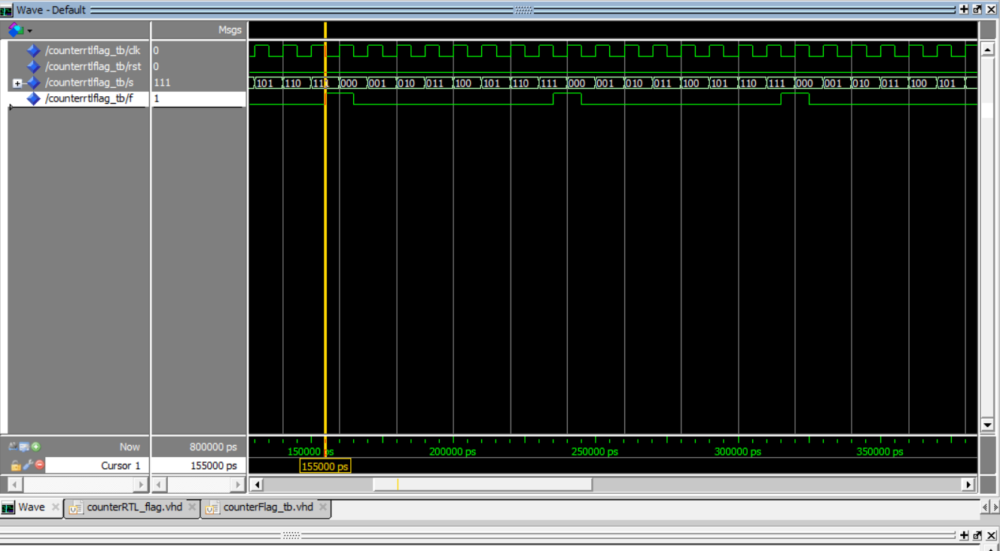
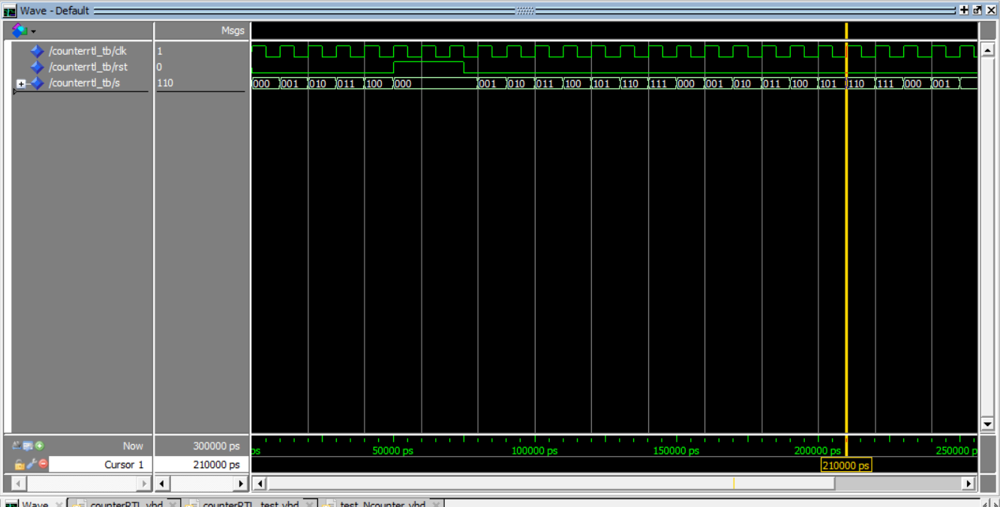

# counter_modulo_8

## test_bascule_avec_reset_simulation

## test_simulation_bascule_D_sans_RST

## counter_RTL_simulation

## counter_RTL_avec_concurent_process_at_the_flag

## piege(temps_symbolique_delta_cycle)

## simulation_counterRTL_avec_reset
